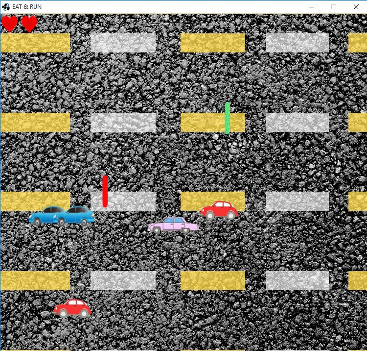

### Eat and Run

#### Grupo: The X Team

Integrantes:

- Guido Nuñez Bevilacqua
- Lucas Mendoza
- Lucas Vero
- Magali Modugno

#### Descripción e instrucciones:

Primer Nivel: Homero debe trabajar, tiene que obtener 10 horas de trabajo (agarrando las barras de uranio) y evitar las donas, que lo distraen y hace que pierda horas de Trabajo.

Segundo Nivel: para obtener dinero, Homero debe agarrar las monedas y billetes que aparecen en pantalla. Homero debe ponerse borracho. Sin embargo, no puede quedarse sin plata. Cada cerveza cuesta 3 unidades de dinero.

Tercer Nivel: Homero debe destruir 5 autos. Para esto debe chocarlos, pero estando en estado radioactivo. De otra forma, sufrirá daño y perderá una vida (siendo 3, el máximo a perder). Para conseguir el estado radiactivo, debe agarrar las barras de uranio. Sin embargo, no debe agarrar dos barras de uranio seguidas. 

